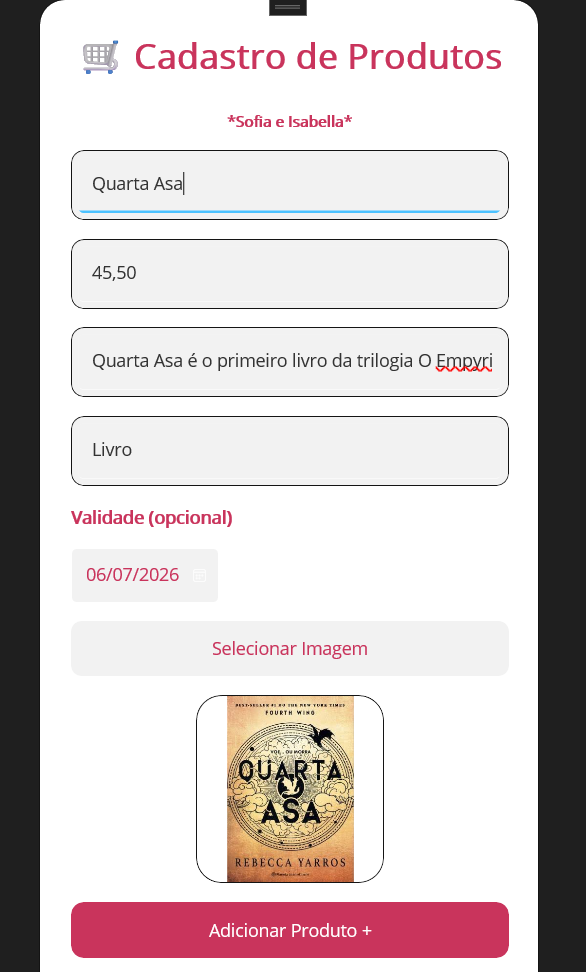
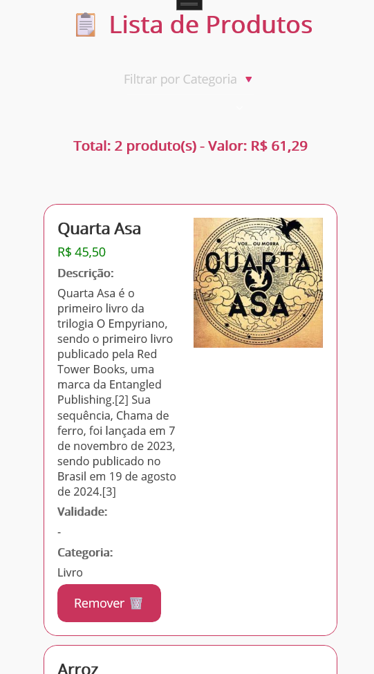
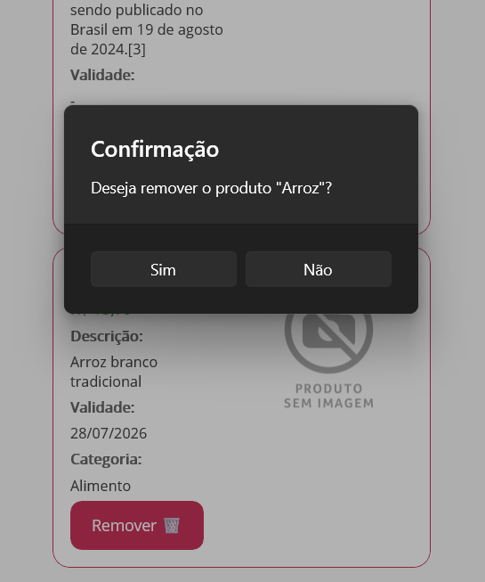

# 📦 Cadastro de Produtos  (desenvolvido no curso técnico em Desenvolvimento de sistemas)

Aplicativo desenvolvido como atividade acadêmica com o objetivo de praticar o desenvolvimento de aplicações mobile utilizando **.NET MAUI**.

O projeto consiste em um sistema simples para cadastro de produtos, permitindo o preenchimento de informações como nome, preço, descrição, categoria, validade e imagem do produto. Durante o desenvolvimento foram aplicados conceitos de manipulação de formulários, validação de dados e interação com recursos do dispositivo, como a seleção de imagens.

## Tecnologias utilizadas

- .NET MAUI
- C#
- XAML

## Funcionalidades

- Cadastro de produtos;
- Campo opcional para data de validade;
- Seleção de imagem da galeria do dispositivo;
- Visualização da imagem selecionada;
- Lista de visualização de produtos.
- Exclusão de produtos

## Imagens do projeto

